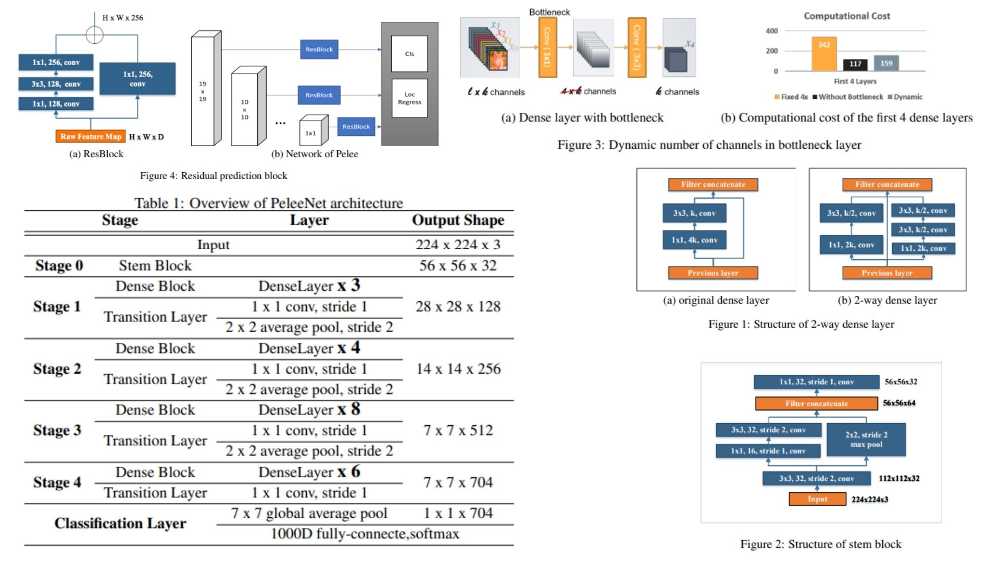

# 👁️ PeleeNet-Replication — Efficient Feature Extraction Network for Mobile Vision

This repository provides a **faithful Python replication** of the **PeleeNet architecture** for efficient image classification and real-time object detection. It reconstructs the full pipeline described in the original paper, including a **stem-based input reduction, two-way dense layers, dynamic bottleneck design, and optimized transition stages**.

Paper reference: *Pelee: A Real-Time Object Detection System on Mobile Devices*  https://arxiv.org/abs/1804.06882  

---

## Overview 🪶



> The architecture builds upon DenseNet-style connectivity while introducing a **computationally efficient stem block, dual-branch dense layers, and adaptive channel bottlenecks**, targeting both accuracy and real-time performance on mobile devices.

Key points:

* **Stem Block** reduces input resolution while preserving rich low-level features through multi-branch convolution and pooling fusion  
* **Two-Way Dense Layer** introduces dual receptive field learning via parallel convolution paths, enabling multi-scale feature extraction  
* **Dense Connectivity** follows feature reuse strategy:
  $$x_l = H_l([x_0, x_1, ..., x_{l-1}])$$
* **Dynamic Bottleneck Design** adjusts intermediate channel dimensions based on input complexity, reducing redundant computation  
* **Transition Layers** perform resolution reduction without aggressive compression to preserve representational capacity  

---

## Core Math 📐

**Dense connectivity pattern:**

$$
x_l = H_l([x_0, x_1, ..., x_{l-1}])
$$

**Dynamic bottleneck constraint:**

$$
C_{bottleneck} = \min(4k, C_{in})
$$

**Two-way dense feature extraction:**

$$
F_1 = Conv_{3\times3}(Conv_{1\times1}(x))
$$

$$
F_2 = Conv_{3\times3}(Conv_{3\times3}(Conv_{1\times1}(x)))
$$

$$
F_{out} = Concat(F_1, F_2, x)
$$

**Cosine learning rate schedule:**

$$
lr(t) = \frac{1}{2} lr_0 \left( \cos\left(\frac{\pi t}{T}\right) + 1 \right)
$$

---

## Why PeleeNet Matters 🧿

* Eliminates dependency on depthwise separable convolutions while maintaining real-time efficiency  
* Achieves strong performance through **carefully balanced architectural design instead of extreme operator optimization**  
* Optimized for real hardware execution (GPU / embedded devices) rather than theoretical FLOPs reduction  
* Strong trade-off between **accuracy, model size, and inference speed**  

---

## Repository Structure 🏗️

```bash
PeleeNet-Replication/
├── src/
│   ├── blocks/
│   │   ├── conv_bn.py              
│   │   ├── stem_block.py          
│   │   ├── dense_layer.py         
│   │   ├── two_way_dense.py       
│   │   ├── bottleneck_dynamic.py  
│   │   └── transition_layer.py    
│   │
│   ├── modules/
│   │   ├── dense_block.py         
│   │   ├── stage_builder.py       
│   │   ├── pelee_block.py        
│   │   └── classifier.py         
│   │
│   ├── model/
│   │   └── pelee_net.py          
│   │
│   └── config.py                 
│
├── images/
│   └── figmix.jpg                 
│
├── requirements.txt
└── README.md
```

---

## 🔗 Feedback

For questions or feedback, contact:  
[barkin.adiguzel@gmail.com](mailto:barkin.adiguzel@gmail.com)
